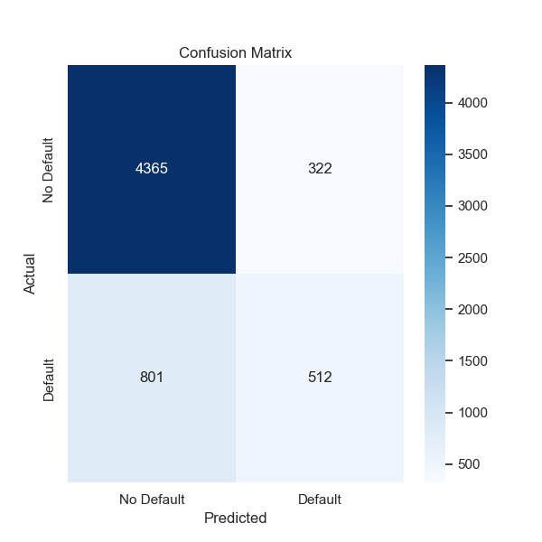
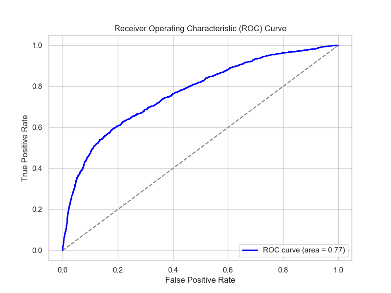

# Random Forest Model Card

## Model Description
This model is a Random Forest Classifier used to predict whether a customer will default on a loan. The model was trained on a dataset with features related to financial information and customer behavior. It was tuned using GridSearchCV to find the best hyperparameters and mitigate class imbalance by applying class weights.

## Model Evaluation

- **Accuracy**: 0.73 (with threshold adjustment of 0.25)
- **Precision**: 0.42 for Default, 0.88 for No Default
- **Recall**: 0.65 for Default, 0.75 for No Default
- **F1-Score**: 0.51 for Default, 0.81 for No Default

## Confusion Matrix
The confusion matrix below shows the model's performance on the test set:



## ROC Curve
The ROC curve demonstrates the model's ability to distinguish between classes (Default vs. No Default). The area under the curve (AUC) is an important metric for evaluating the model's discriminative power.



## Hyperparameters
- `n_estimators`: 200
- `max_depth`: None
- `min_samples_split`: 5
- `min_samples_leaf`: 1
- `class_weight`: 'balanced'

## Usage
To use this model for predictions, you can load it with the following code:

```python
import joblib
# Load the trained model
rf_model = joblib.load('best_rf_model.pkl')

# Make predictions
y_pred = rf_model.predict(X_test_scaled)
#Model License
This model is provided for educational and research purposes. It should not be used in production environments without further validation and testing.

